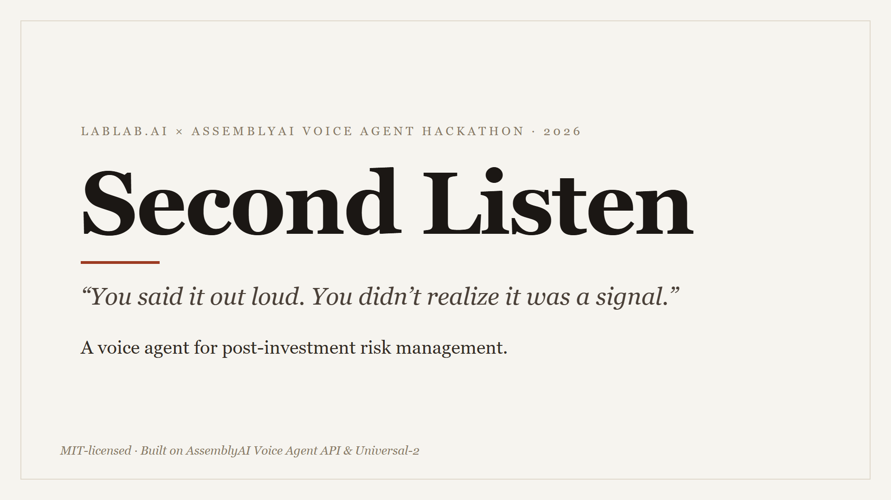

# Second Listen

> *You said it out loud. You didn't realize it was a signal.*
>
> Every VC tracks metrics. Nobody captures what they hear.

**Second Listen** is a voice agent for post-investment risk management. After a founder call, board meeting, or site visit, the investor talks to it for two minutes — casually retelling what happened. The agent, powered by a structured risk-grading playbook, listens for risk signals hidden in small talk, asks checklist-driven follow-up questions, and turns the debrief into evidence tables, ledger updates, and escalation flags.

Built for the [lablab.ai × AssemblyAI Voice Agent Hackathon](https://lablab.ai/ai-hackathons/assemblyai-voice-agent-hackathon) (Sep 1–30, 2026).

## Why voice

Post-investment risk signals come in two channels:

- **Dashboard signals** (revenue decline, runway < 6 months) — visible in KPI reports, already covered by portfolio monitoring tools.
- **Conversation signals** (key-person departure, funds used outside the agreed purpose, litigation) — they only surface in conversations. By the time quarterly review forms get filled, memory has eaten half the evidence.

Second Listen covers the second channel: the gap between "the conversation happened" and "the signal is in the ledger".

## How it works

1. **Debrief** — after a call, press and talk for ~2 minutes.
2. **Interrogate** — the agent follows the playbook's escalation checklist ("Who's covering finance since the CFO left? Was there written approval for moving the grant money?"), one question at a time.
3. **Record** — produces an evidence table with timestamps, a risk-ledger update, escalation flags per policy, and a downloadable Markdown follow-up note per company. The AI surfaces evidence and suggestions; **humans grade**.

Prefer not to talk? **Analyze recording** uploads a pre-recorded debrief (Chinese works too): Universal-2 transcribes it and the same playbook returns a signal list plus follow-up questions — no live dialogue needed.

## Demo

<a href="demo/SecondListen_demo_v7.mp4"></a>

The 3:44 demo runs the real product end to end: a second check-in call that reopens last week's follow-ups one at a time, live evidence capture with the investor's own quotes, and an upload-mode analysis of a recording. Narration script: [docs/hackathon-demo-script-2min.md](docs/hackathon-demo-script-2min.md).

## Tech

- [AssemblyAI Voice Agent API](https://www.assemblyai.com/docs/voice-agents/voice-agent-api) — one WebSocket for STT + LLM + TTS, turn detection, barge-in, tool calling
- Playbook skill: a structured risk-grading framework (three-level grading, five evidence dimensions, escalation checklist) injected as the agent's system prompt
- Backend is Python standard library only — `requirements.txt` installs nothing; audio transport runs in the browser (`AudioContext` + `AudioWorklet`) directly against the AssemblyAI WebSocket

## Run locally

Windows: double-click [`启动SecondListen.bat`](启动SecondListen.bat) in the repo root, then open `http://localhost:3000`.

Any OS with Python 3.9+:

```sh
cd app
cp .env.example .env        # add your ASSEMBLYAI_API_KEY
AGENT=second-listen python publish.py
python deployment/browser/server.py
```

Deployment and private-trial options are in [TEAM.md](TEAM.md).

## Repo layout

```
docs/system-prompt.md   the agent's playbook prompt (v0.4, evolving)
docs/demo-script.md     the 45-second debrief monologue with buried signals
docs/demo-script-zh.md  the same monologue in Chinese, for the comparison round
docs/hackathon-demo-script-2min.md
                        the submission video narration script
docs/hackathon-demo-shot-list.md
                        capture order and final video safety checklist
docs/roadmap.md         build milestones for the hackathon month
docs/live-test-checklist.md
                        one boot, three calls: everything that needs a voice,
                        with pass/fail for each check
docs/submission-copy.md the lablab submission form copy (title, short/long
                        description, tracks) with character/word counts
demo/                   the submission video (SecondListen_demo_v7.mp4)
slides/                 cover image (16:9) and the slide deck PDF, plus the
                        HTML source the PDF was printed from
skill/                  the playbook skill (ported from the author's published MIT risk-grading template)
app/                    agent implementation — the AssemblyAI starter plus the Second Listen agent
```

## Cross-debrief memory

Each company keeps one small JSON history file (`app/data/history/<company>.json`). The next debrief for that company opens by checking the previous session's follow-ups — owner, deadline and all — one at a time, and skips re-asking signals already recorded. No database, no vector store; details in [docs/roadmap.md](docs/roadmap.md).

## License

MIT — see [LICENSE](LICENSE). The playbook skill keeps the original template's MIT notice in `skill/LICENSE`.
